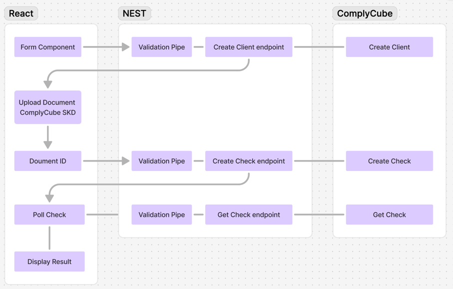

# Getting Started

## Clone the Repository
```sh
git clone git@github.com:ryan-wheatley/technical-ex.git
cd technical-ex
```

## Install Dependencies
```sh
npm install
```

## Set Up Environment Variables

Create an `.env.local` file in `apps/frontend` and add:
```sh
VITE_API=http://localhost:3000
```

Create an `.env.local` file in `apps/backend` and add:
```sh
COMPLYCUBE_API_KEY=your-test-api-key
FRONTEND_URL=http://localhost:5173
```

## Run Development Servers
```sh
npx turbo dev
```

## Running Tests

### Unit Tests
```sh
cd apps/backend
npm run test
```

### End-to-End Tests
```sh
cd apps/backend
npm run test:e2e
```

## Architecture
This project follows a **monorepo** structure using **Turbo**.
- **Backend:** NestJS (deployed on Render)
- **Frontend:** Vite + React (deployed on Vercel)

## Live Demo
Check out the live demo: [https://technical-ex.vercel.app](https://technical-ex.vercel.app)

## Test Data for Verification
Use the following details for a successful verification result:
```sh
First Name: John
Last Name: Doe
DOB: 10/10/1995
Email: example@example.com
```

Use the following details for an unsuccessful verification result:
```sh
First Name: John
Last Name: failed
DOB: 10/10/1995
Email: example@example.com


```

## Architecture Diagram
